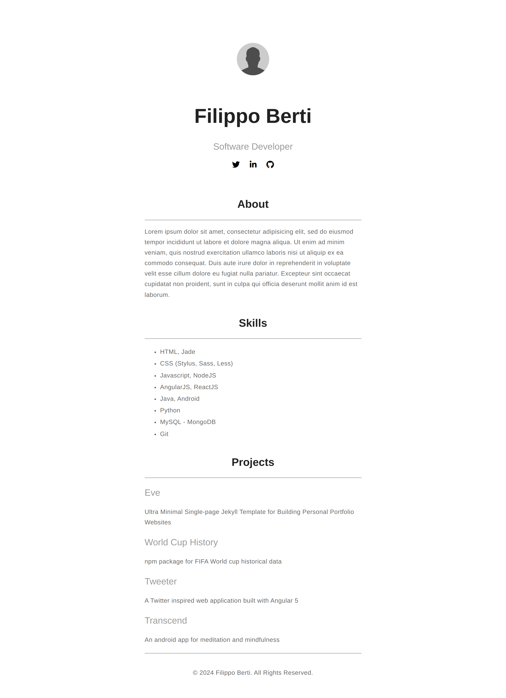

# ESP32 Self-Hosted Web Server - Minimal Portfolio Website



A minimal portfolio website hosted on an ESP32 as a self-hosted web server.

## Features

- **Minimalistic Design**: Clean and simple portfolio website design.
- **ESP32 Web Server**: Hosted on an ESP32 microcontroller.
- **Responsive**: Designed to work well on various screen sizes.
- **Skills, Projects, About Me**: Sections to showcase skills, projects, and personal information.

## Getting Started

### Hardware Requirements

- ESP32 Development Board
- USB Cable for ESP32
- Computer with Arduino IDE installed

### Software Dependencies

- [Arduino IDE](https://www.arduino.cc/en/software)
- [ESPAsyncWebServer](https://github.com/me-no-dev/ESPAsyncWebServer) library

### Installation

1. Clone this repository:

    ```bash
    git clone https://github.com/yourusername/esp32-self-hosted-portfolio.git
    ```

2. Open the Arduino IDE.

3. Install the ESPAsyncWebServer library: Sketch > Include Library > Manage Libraries > Search for "ESPAsyncWebServer" > Install.

4. Open the `esp32_self_hosted_portfolio.ino` file in the Arduino IDE.

5. Configure the WiFi SSID and password in the code:

    ```cpp
    const char *ssid = "your-ssid";
    const char *password = "your-password";
    ```

6. Upload the code to your ESP32.

## Accessing the Portfolio Website

1. After uploading the code, open the Serial Monitor in the Arduino IDE.

2. Find the IP address assigned to your ESP32 by the local network.

3. Open a web browser and enter the IP address in the address bar.

## Making it Accessible from Outside (Optional)

### Opening Port on Router

To access the website from outside your local network, open the port on your router:

1. Find your ESP32's local IP address.

2. Access your router's settings page (usually by entering `192.168.1.1` or similar in a browser).

3. Locate the Port Forwarding section and add a new rule:

    - External Port: Choose an available port (e.g., 8080).
    - Internal IP Address: Your ESP32's local IP.
    - Internal Port: 80 (default for HTTP).

### Getting a Domain with DuckDNS

1. Sign up for a free account on [DuckDNS](https://www.duckdns.org/).

2. Create a domain name (e.g., yourname.duckdns.org).

3. Follow DuckDNS's instructions to set up dynamic DNS on your router.

4. Use the domain to access your ESP32 web server from anywhere.

## License

This project is licensed under the [MIT License](LICENSE).
